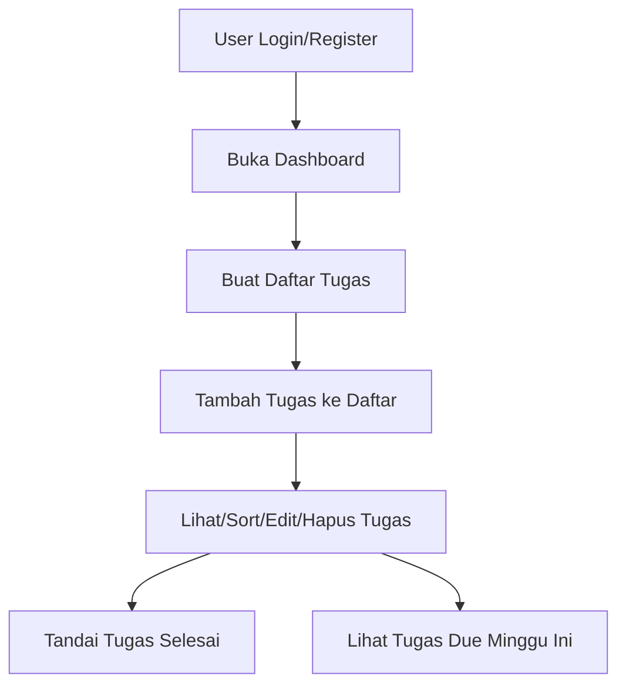

# CATATAN Implementasi Fitur Task Management

## 1. Diagram Alur Fitur Utama

## 2. Langkah-langkah Implementasi

- **Setup Routing**
  - Konfigurasi route: `/`, `/lists`, `/tasks`, `/tasks/add`, `/tasks/edit/:taskId`
- **Autentikasi**
  - Implementasi register & login (JWT)
  - Simpan token di context/state
- **Manajemen Daftar**
  - Buat komponen List: tambah, edit, hapus, tampilkan daftar
  - Integrasi dengan API `/api/lists`
- **Manajemen Tugas**
  - Buat komponen TaskList & TaskForm: tambah, edit, hapus, tandai selesai
  - Integrasi dengan API `/api/tasks`, `/api/lists/{listId}/tasks`
  - Implementasi sorting dan filter tugas due minggu ini
- **UI & UX**
  - Gunakan Tailwind CSS untuk styling responsif dan dark mode
  - Tambahkan animasi transisi sederhana
  - Loading state dan error handling di setiap aksi
- **Testing**
  - Unit test untuk komponen utama (Jest/RTL)
  - E2E test untuk flow utama (Cypress/Playwright)
- **Dokumentasi**
  - Update checklist dan PRD sesuai progress
  - Pastikan API sesuai dokumentasi Swagger UI

## 3. Catatan Teknis

- Semua data di-fetch dari API backend sesuai endpoint di PRD.
- State management menggunakan React Context untuk autentikasi dan data global.
- Error dan loading state di-handle di setiap komponen.
- Fitur edit menggunakan pre-filled form dan navigasi dinamis.
- Validasi input dan feedback user di setiap aksi (toast, alert, dsb).
- Responsive dan dark mode diaktifkan dengan Tailwind utility class.

---

**Referensi:**  
- [PRD](./prd.md)  
- [Checklist Implementasi](./implementation-checklist.md)
